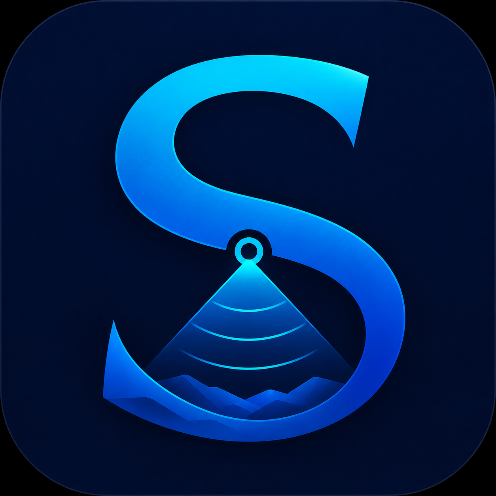

# SonarSuite

<p align="center">
  
</p>

SonarSuite is a free and open-source alternative to SonarWiz for processing
side-scan sonar data. It is designed to provide a lightweight, fast, and stable
desktop workflow for field processing, target review, and GIS-ready exports.

SonarSuite was forked from the excellent
[SidescanTools](https://github.com/sonoware/sidescantools) package.

SonarSuite currently supports **JSF** (`.jsf`) and **XTF** (`.xtf`) sonar files.
Support for additional formats is planned.

**[Download SonarSuite for Windows](https://github.com/StrikeLines/sidescantools/releases/latest/download/SidescanTools-Windows-x64.zip)**

New user? Jump to the [Windows Setup Quickstart](#windows-setup-quickstart).


## Complete side-scan workflow

SonarSuite supports the complete GUI-based side-scan workflow:

- Import individual JSF or XTF files and move between survey lines.
- Review continuous port and starboard data in the waterfall viewer.
- Automatically calculate, manually edit, and save the bottom track.
- Read recorded cable-out or layback and apply a manual layback override.
- Adjust overall gain, spreading, and absorption with TVG controls.
- Use Auto TVG with a configurable brightness target.
- Apply destriping, slant-range correction, and EGN processing.
- Digitize sonar targets, edit their details, and export them as GPX waypoints.
- Export a single survey line or a directory of files as georeferenced GeoTIFFs.

## Windows Setup Quickstart

The release build is recommended for nearly all Windows users. It does not
require Python, Conda, or a development environment.

1. **[Download the Windows ZIP](https://github.com/StrikeLines/sidescantools/releases/latest/download/SidescanTools-Windows-x64.zip).**
2. Unzip the downloaded file.
3. Open the extracted `SidescanTools` folder.
4. Double-click `SidescanTools.exe`.

Keep `SidescanTools.exe` and its `_internal` folder together. The application
opens to the main workspace and waits for you to select a sonar file.

## Processing and project details

SonarSuite creates a number of ancillary files in the same directory as the
input sonar data file. Processing choices are saved separately for each sonar
file in a small `<filename>.tvg_gain.cfg` sidecar beside the source data. When
that line is opened again, SonarSuite restores its TVG, brightness target, view
mode, speed correction, EGN table, destripe setting, slant-range correction,
and manual layback.

Bottom tracks are saved beside their source files and can be adjusted directly
on the waterfall. Layback is applied consistently to digitized target positions
and mosaic georeferencing.

GeoTIFF exports use the visible processing settings so their colors match the
waterfall. Exports support WGS 84 (`EPSG:4326`) and Web Mercator (`EPSG:3857`)
and are written beside the original sonar files. Directory batch export applies
each file's own saved processing configuration.

Target records are stored in a SQLite project database. Saved targets can be
recalculated after geometry changes and exported as WGS 84 GPX waypoints.

## Installing from source on Windows

Building from source is intended for developers. Most users should install the
**[Windows release binary](https://github.com/StrikeLines/sidescantools/releases/latest/download/SidescanTools-Windows-x64.zip)**.

Source installation requires Git and Miniconda or Anaconda. Open Anaconda
Prompt or a Conda-enabled PowerShell and run:

```powershell
git clone https://github.com/StrikeLines/sidescantools.git SonarSuite
cd SonarSuite
conda env create -f environment.yml
conda activate env_sidescantools
python -m pip install -e .
sidescantools-contacts --viewer qt
```

The GUI can start without a sonar filename; use its **Open** controls to select
a JSF or XTF file. Windows release maintainers can also follow the
[release build instructions](docs/windows-release.md).

## Project and support

SonarSuite is a project of [StrikeLines](https://strikelines.com/).

For feature requests or bug reports, please
[create a GitHub issue](https://github.com/StrikeLines/sidescantools/issues).

SonarSuite is released under the [GNU General Public License v3.0](LICENSE).
